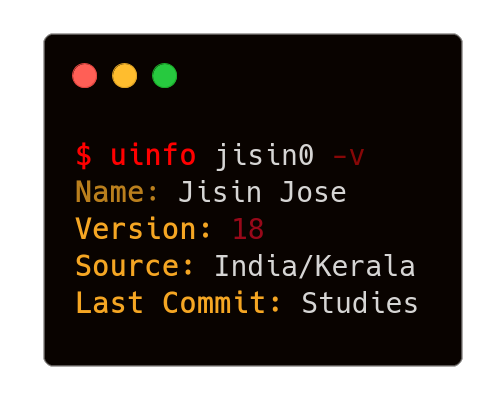

  
&nbsp;&nbsp;

  

  

  

### LANGUAGES & TOOLS >>>>

### ACTIVITY >>>>
<!--START_SECTION:activity-->
1. ❌ Closed PR [#5](https://github.com/Jisin0/TGMessageStore/pull/5) in [Jisin0/TGMessageStore](https://github.com/Jisin0/TGMessageStore)
2. 💪 Opened PR [#100](https://github.com/celestix/gotgproto/pull/100) in [celestix/gotgproto](https://github.com/celestix/gotgproto)
3. 🎉 Merged PR [#2](https://github.com/Jisin0/TGMessageStore/pull/2) in [Jisin0/TGMessageStore](https://github.com/Jisin0/TGMessageStore)
4. 🎉 Merged PR [#9](https://github.com/Jisin0/filmigobot/pull/9) in [Jisin0/filmigobot](https://github.com/Jisin0/filmigobot)
5. 🎉 Merged PR [#8](https://github.com/Jisin0/filmigobot/pull/8) in [Jisin0/filmigobot](https://github.com/Jisin0/filmigobot)
<!--END_SECTION:activity-->

